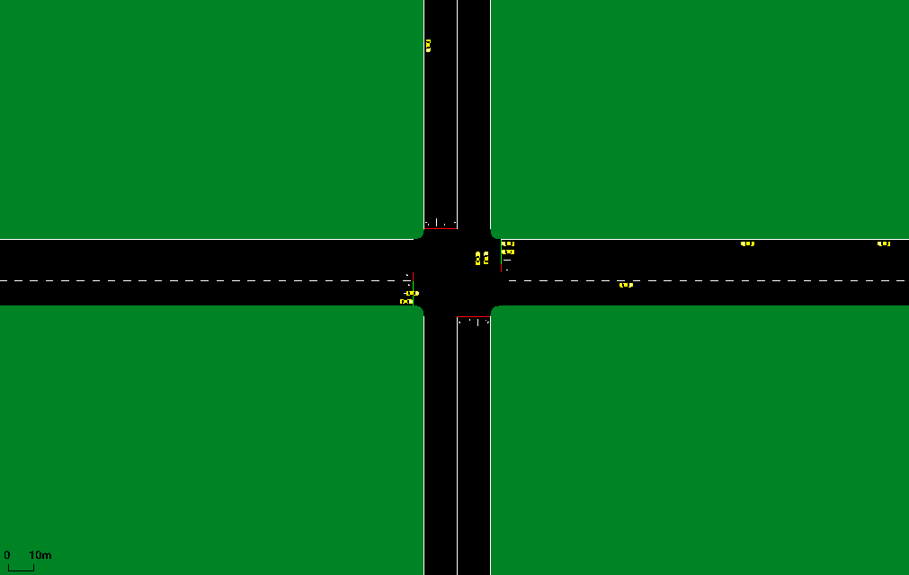
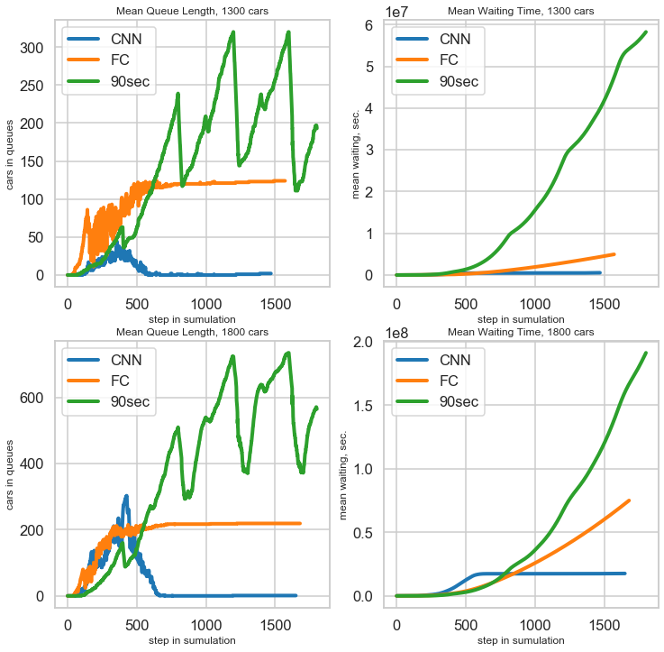

# Traffic Signal Control with Reinforcement Learning
This repository contains my project on intelligent traffic lights control. It relies on a Deep Q-network algorithm
 with a few convolutional layers.

Below you may find detailed explanation of files in here, also some comments on model, final result and work to be done.
 
The preview of final result.

*CNN-DQN, 1800 cars*
---

# Contents 
* `src/data_storage.py` – a dataclass for storing environment data in one place
* `src/dqn.py` – a PyTorch DQN models
* `src/env.py` – an API to communicate with simulator
* `src/generator.py` – traffic generation resides here
* `src/memory.py` – the model has replay memory implemented, it resides here
* `src/test.py` – yet fairly useless file
* `src/training.py` – training happens here
* `cfg/` – a directory with SUMO configs.

if you wish to train your own model, edit `config.yaml`, then run `train.py -c config.yaml`.

# Model and Environment
To simulate the intersection, Simulation of Urban MObility ([SUMO](https://www.eclipse.org/sumo/)) is used. To
communicate with Python, TraCI API is provided as one of the tools of SUMO.
 
To perform Reinforcement Learning, Deep Q-learning algorithm was chosen. In order for an agent to perform actions
, firstly it observes the situation on the road, namely, it constructs two matrices. The first matrix divides the
road into 16 segments of 7 meters each and checks whether there is a car in a segment. The second matrix checks the
speed of a car in that segment. Those two matrices are fed into Conv-NN, then concatenated with vector of traffic
signal state and magic happens!

Since the nature of DQN is very unstable, two methods were used to stabilize its convergence. Firstly, Replay Memory
was implemented, which stores past actions and allows to use training in batches over them. The second thing is the
concept of a target Q-network. It allows not to chase the "moving target" while training by initializing two networks
with the same weights. While optimizing, the weights of target network are kept as they are and updated only after N
iterations. 

The final models are kept under `model` directory. Two models, namely convolutional and fully-connected ones are
trained, both with 1600 epochs, 4500 steps each (1.15 hours). Those models were trained on CPU and it took around 24
hours for each of them.

# Results
[Youtube video with comparison](https://www.youtube.com/watch?v=yIhDWvMrWFo)
For testing purposes, three scenarios were generated with 800, 1300, 1800 cars. They represent three possible states
of the road during low load, mid and peak-hour accordingly. The results for each are presented in the table below.

| Metric (mean, std, n_cars=800) | Queue cars | Cumulative Waiting Time sec |
|:-:|:-:|:-:|
| CNN-DQN | (1.99, 2.27) | (4.26e04, 2.76e04) |
| FC-DQN | (47.25, 18.04) | (1.23e06, 1.42e06) |
| 90sec. | (87.34, 58.42) | (1.09e07, 1.11e07) |

| Metric (mean, std, n_cars=1300) |   Queue cars   | Cumulative Waiting Time sec |
|:------------------------------:|:--------------:|:---------------------------:|
|             CNN-DQN            |   (5.7, 9.1)   |      (3.56e05, 1.89e05)     |
|             FC-DQN             | (100.66, 34.3) |      (6.38e07, 7.02e07)     |
|             90sec.             | (144.44, 91.7) |      (1.87e07, 1.91e07)     |

| Metric (mean, std, n_cars=1800) | Queue cars | Cumulative Waiting Time sec |
|:-:|:-:|:-:|
| CNN-DQN | (26.41, 42.58) | (3.98e06, 2.29e06) |
| FC-DQN | (174.89, 68.83) | (1.21e08,1.33e08) |
| 90sec. | (235.51, 159.42) | (2.78e07, 3.01e07) |

When the load is at peak, on average 117 seconds a vehicle waits in the que (CNN). That is 20% better than a steady
90 sec cycle.  As it can be seen, FC-DQN cannot manage medium road load, however CNN-DQN manages to operate with
high load with no problem.

# Future work
- [ ] Refactor code
- [ ] Parallel code
- [ ] Try actor-critic model (i.e. d4pg)
- [ ] Manage several intersections
- [ ] Obtain a GPU...

# References
Genders, Wade, and Saiedeh Razavi. "Using a deep reinforcement learning agent for traffic signal control." arXiv preprint arXiv:1611.01142 (2017).

Wade Genders & Saiedeh Razavi (2019): Asynchronous n-step Q- learning adaptive traffic signal control, Journal of Intelligent Transportation Systems, DOI: 10.1080/15472450.2018.1491003
