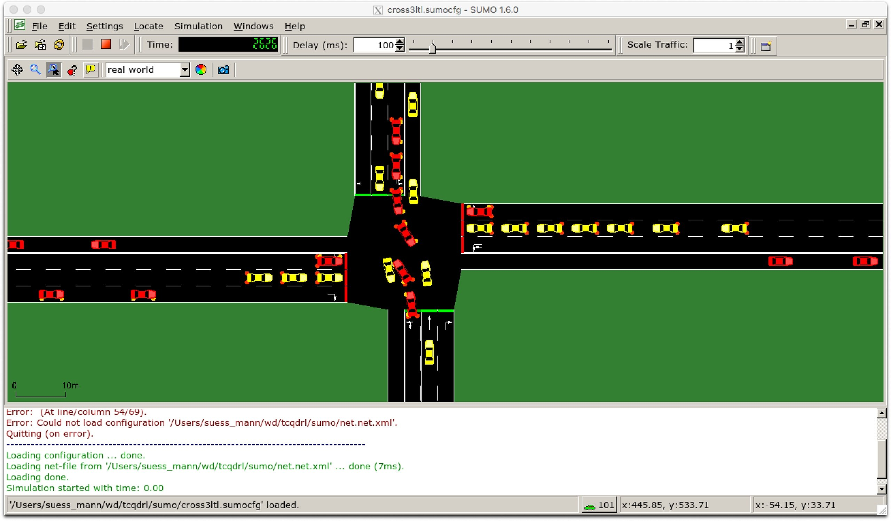

# Traffic Control with DL
Here I am trying to teach a computer how to effectively change signals of traffic lights on an intersection. The repo is updating..

# References
Genders, Wade, and Saiedeh Razavi. "Using a deep reinforcement learning agent for traffic signal control." arXiv preprint arXiv:1611.01142 (2017).

Wade Genders & Saiedeh Razavi (2019): Asynchronous n-step Q- learning adaptive traffic signal control, Journal of Intelligent Transportation Systems, DOI: 10.1080/15472450.2018.1491003
